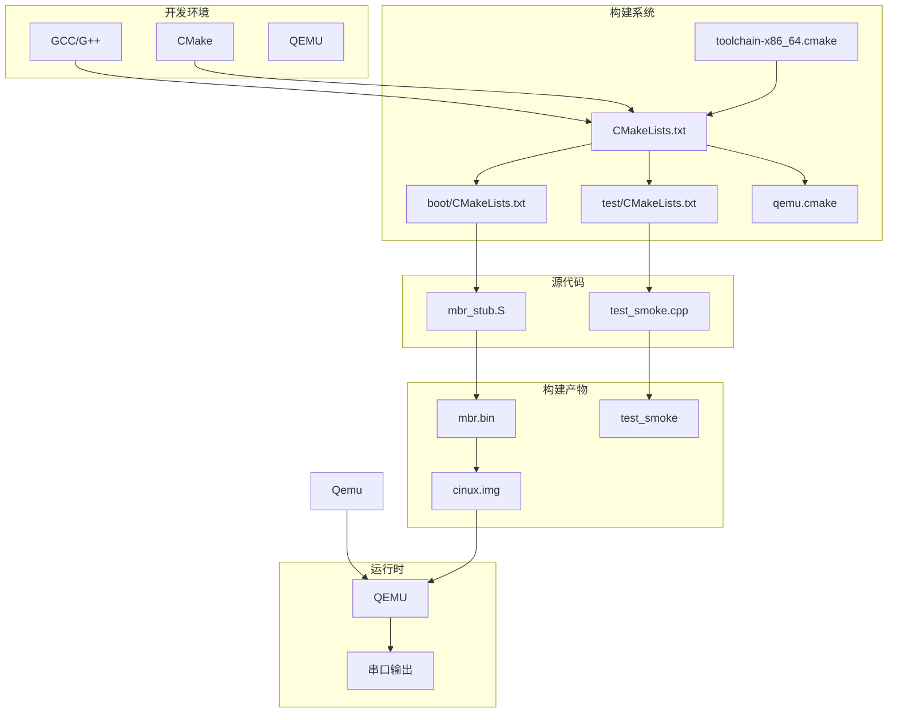

# Phase 0 · 环境与工具链

> **本章目标**：搭建 Cinux 开发环境，完成工具链验证，构建第一个可启动的 MBR 存根，跑通测试框架。
>
> **完成后的效果**：`make run` 启动 QEMU，屏幕上显示一个蓝色的 "C"；`make test` 跑通冒烟测试。

---

## 本章概览

这是 Cinux 操作系统教程的第一章，我们从零开始搭建开发环境。说真的，搭建开发环境这件事看起来很 boring，但它能让你在后面少踩无数坑。很多人写 OS 教程喜欢直接跳过这一步，让你自己"去装个交叉编译器"，结果你照着网上的一堆命令敲完，也不知道自己到底干了啥，等到后面编译报错、链接报错、QEMU 起不来的时候，只能对着终端发呆。

在这一章里，我们做的事情不算多，但每一步都有它的道理。我们会安装必要的开发工具，配置 CMake 构建系统，写一个只有几行指令的 MBR 存根，再跑个 `1+1=2` 的测试。这些东西都是后面写 bootloader 和内核的基础，现在偷懒跳过去，后面一定会还回来。

### 关键设计决策一览

- **不使用专门的交叉编译工具链**：直接用系统自带的 GCC，只要把编译选项配置正确就行。这个决策让环境搭建大大简化，不需要去折腾什么 `x86_64-elf-gcc` 之类的东西。
- **使用 CMake 作为构建系统**：虽然手写 Makefile 也能工作，但 CMake 的声明式语法更清晰，而且能方便地生成跨平台的构建文件。
- **自研轻量测试框架**：不用 Google Test 或 Catch2，自己写一个简单的测试框架。这样既能理解测试框架的原理，又能避免引入外部依赖。
- **AT&T 汇编语法**：使用 GNU Assembler（GAS）的 AT&T 语法，而不是 NASM 的 Intel 语法。这是因为在 Linux 环境下，GCC 和 GAS 的配合更自然。

### 与同类 OS 项目的设计对比

xv6 使用 Makefile 作为构建系统，并且直接在内核代码中混合了 C 和汇编。Linux 早期的构建系统也是基于 Make，后来才迁移到更复杂的 Kbuild 系统。Cinux 选择 CMake，是因为它在保持简单的同时，提供了更好的可扩展性和跨平台支持。另外，xv6 使用 GCC 的默认选项编译内核，而 Cinux 显式地设置了 `ffreestanding` 等选项，让编译器明确知道我们在写 freestanding 代码。

---

## 架构图

---

## 关键代码精讲

### 1. 工具链检查脚本

工具链检查脚本 `scripts/check_toolchain.sh` 是我们开发环境的第一道防线。在开始写代码之前，我们需要确保所有必需的工具都已经安装并且版本正确。这个脚本会检查 GCC、G++、binutils（as、ld、objcopy）、QEMU 和 CMake。

脚本的核心是一个辅助函数 `check_command`，它使用 `command -v` 来检测命令是否存在。`command -v` 比传统的 `which` 更可靠，因为它是一个 POSIX 标准命令，并且在各种 shell 中的行为一致。如果命令不存在，脚本会打印错误信息并给出安装提示，然后直接退出。

对于 CMake，我们还需要检查版本。Cinux 要求 CMake 版本至少为 4.1，这是为了支持现代 CMake 的特性。版本检查通过解析 `cmake --version` 的输出，提取版本号，然后用 `bc` 进行数值比较。

脚本使用了一个共享的日志模块 `scripts/log/logging.sh`，提供了带颜色的输出函数。这让脚本的输出更容易阅读，[INFO] 是绿色，[ERROR] 是红色，[WARN] 是黄色。

### 2. GCC 工具链配置

这是整个构建系统的核心。很多人以为写 OS 必须装专门的交叉编译工具链，比如 `x86_64-elf-gcc`，但其实不是必需的。系统的 GCC 完全可以编译内核，关键是要告诉它"别瞎自作聪明"。

`cmake/toolchain-x86_64.cmake` 文件做了几件重要的事情。首先是 `set(CMAKE_SYSTEM_NAME Generic)`，这是 CMake 的"freestanding 模式"开关。当 CMAKE_SYSTEM_NAME 设置为 Generic 时，CMake 知道这是一个 freestanding 环境，不会去寻找标准库和运行时组件。

然后是编译标志。`-ffreestanding` 告诉编译器不要假设有标准库，这会影响编译器的很多优化决策。`-fno-stack-protector` 禁用栈保护，因为内核需要自己管理栈。`-mno-red-zone` 禁用红区优化，这一点在中断处理时特别重要，因为中断可能会使用红区，导致栈被破坏。`-mcmodel=kernel` 使用内核代码模型，允许代码链接到更高的地址。

对于 C++，我们还添加了 `-fno-exceptions` 和 `-fno-rtti`，禁用异常和运行时类型信息。内核需要自己实现异常机制，或者干脆不用异常。`-std=c++23` 让我们可以使用现代 C++ 的特性，同时不用标准库。

链接器标志中，`-nostdlib` 禁止链接标准库，`-static` 强制静态链接，`-Wl,--build-id=none` 禁用 build-id 以减少二进制大小。

### 3. 顶层 CMakeLists.txt

`CMakeLists.txt` 是 CMake 构建系统的入口。首先，`cmake_minimum_required(VERSION 4.1)` 设置了最低 CMake 版本要求。然后 `project()` 声明了项目名称、版本和支持的语言。

这里有一个自动配置工具链文件的机制。如果用户没有显式指定 `CMAKE_TOOLCHAIN_FILE`，我们会自动使用项目自带的 `cmake/toolchain-x86_64.cmake`。这让新手上手更容易，不需要记住长长的 cmake 命令参数。

`add_subdirectory()` 指令递归处理子目录的 CMakeLists.txt。我们会添加 boot、kernel 和 test 子目录。测试的构建由一个 `option()` 控制，用户可以通过 `-DCINUX_BUILD_TESTS=OFF` 来禁用测试构建。

最后，我们包含 `cmake/qemu.cmake`，它定义了 `run` 和 `run-debug` 目标，让开发者可以方便地启动 QEMU。

### 4. QEMU 运行配置

`cmake/qemu.cmake` 定义了几个自定义目标，让开发者可以用简单的 `make run` 命令启动 QEMU，而不需要记住长长的 QEMU 命令行。

`add_custom_command()` 创建了一个自定义构建命令，用于生成磁盘镜像。这个命令依赖于 `mbr` 目标，确保 MBR 已经编译完成。它调用 `scripts/build_image.sh` 脚本，将 MBR 写入磁盘镜像。

`add_custom_target()` 创建了 Make 目标。`image` 目标依赖磁盘镜像，`run` 目标依赖 `image`，并启动 QEMU。`run-debug` 目标额外添加了 `-s -S` 参数，让 QEMU 在启动时暂停，并监听 GDB 连接。

QEMU 的参数中，`-m 512M` 分配 512MB 内存，`-serial stdio` 将串口重定向到标准输入输出，`-no-reboot` 和 `-no-shutdown` 让 QEMU 在 panic 时不自动重启或退出，方便查看错误信息。

### 5. MBR 存根

`boot/mbr_stub.S` 是我们的第一个汇编程序，也是整个 Cinux 的启动入口。BIOS 启动时会将磁盘的第一个扇区（MBR）读入内存的 `0x7C00` 地址，然后跳过去执行。

MBR 的结构非常简单，只有几条指令。首先，我们清屏并打印一个蓝色的 "C"。VGA 文本模式显存位于 `0xB8000`，每个字符单元占用 2 字节：一个字节是字符码，一个字节是属性。属性字节的格式是 `[高4位背景][低4位前景]`，`0x1F` 表示蓝色背景、白色前景。

清屏的循环使用了 `rep stosw` 指令，这是 x86 的字符串操作指令。`stosw` 将 AX 的值写入 ES:DI 指向的内存，然后 DI += 2。`rep` 前缀让指令重复 CX 次。这个组合可以快速填充一块内存。

然后我们关中断（`cli`）、停机（`hlt`），并进入无限循环。`cli` 清除 EFLAGS 的 IF 位，禁用可屏蔽中断。`hlt` 停止 CPU 执行，直到收到中断。由于我们已经禁用了中断，所以 CPU 会永久停机。无限循环是为了防止 CPU 继续执行后面的数据。

MBR 的最后两字节必须是 `0xAA55`，这是 BIOS 识别可启动磁盘的魔数。`.fill` 指令填充到偏移 510，`.word 0xAA55` 写入签名。注意 GAS 的 `.word` 是小端序，所以磁盘上实际是 `55 AA`，BIOS 读取后会成为 `AA55`。

### 6. 镜像构建脚本

`scripts/build_image.sh` 脚本将编译好的 MBR 写入磁盘镜像。首先用 `dd` 创建一个 1MB 的空白镜像，然后用 `dd` 将 MBR 写入第一个扇区。`conv=notrunc` 参数告诉 dd 不要截断输出文件，保留镜像的 1MB 大小。

脚本最后验证 MBR 签名。它读取镜像的最后两字节，用 `xxd -p` 以十六进制打印，然后检查是否为 `55aa`。这是小端序的表示，对应大端序的 `AA55`。

### 7. 测试框架

`test/framework/test_framework.h` 是一个自研的轻量测试框架。它支持两种运行模式：Host 模式在 Linux 上运行，QEMU 模式在内核中运行（通过串口输出）。

框架的核心是 `TEST()` 宏，它使用 C++ 的构造函数自动注册测试。每个 `TEST()` 块会生成一个测试函数和一个全局对象，对象的构造函数调用 `_register_test()` 将测试注册到全局数组中。

`ASSERT_*` 宏在失败时打印文件名和行号，然后增加失败计数并返回。`RUN_ALL_TESTS()` 遍历所有已注册的测试，依次执行，并统计通过和失败的数量。

### 8. 冒烟测试

`test/unit/test_smoke.cpp` 是最基础的测试，验证测试框架本身是否工作正常。测试内容很简单：`1+1=2`、边界值比较、指针断言。如果这些测试都通过，说明测试框架的基本功能是正常的。

---

## 设计决策深度分析

### 决策：不使用专门的交叉编译工具链

**问题**：编写 OS 时，很多人会告诉你要安装专门的交叉编译工具链，比如 `x86_64-elf-gcc`。这真的必要吗？

**本项目的做法**：直接使用系统自带的 GCC 和 G++，只要把编译选项配置正确。关键的选项是 `-ffreestanding`、`-nostdlib`、`-fno-stack-protector`、`-mno-red-zone`、`-mcmodel=kernel` 等，这些选项告诉编译器我们在写 freestanding 代码，不要假设有标准库和操作系统。

**备选方案**：安装专门的交叉编译工具链，比如 `x86_64-elf-gcc`。这可以通过从源码编译 GCC，或者使用预编译的工具链包。

**为什么不选备选方案**：专门的交叉编译工具链增加了环境搭建的复杂度。你需要找到合适的源码、配置编译选项、等待漫长的编译过程。而且，系统的 GCC 完全可以胜任内核编译的任务，只要你把选项配置正确。使用系统 GCC 还能让你更容易获取编译器的更新和 bug 修复。

不过，这个决策也有一个潜在的问题：系统 GCC 可能会产生一些我们不想要的依赖，比如隐式链接某些库。我们通过 `-nostdlib` 来避免这个问题。另外，系统 GCC 的默认目标三元组可能是 `x86_64-linux-gnu`，而不是 `x86_64-elf`，但这对我们的影响不大，因为我们不用标准库。

**如果要扩展/改进**：如果将来需要支持不同的目标架构，比如 ARM 或 RISC-V，那时候可能真的需要交叉编译工具链。到时候可以考虑用 Crosstool-NG 或类似的工具来生成工具链，或者直接使用包管理器提供的预编译工具链。另外，可以考虑用 Docker 容器来封装整个构建环境，让所有开发者使用相同的工具链版本。

### 决策：使用 CMake 而非手写 Makefile

**问题**：构建系统应该用什么？很多人说写 OS 就该手写 Makefile，这样才能理解底层。但 CMake 也很流行，它到底有什么优势？

**本项目的做法**：使用 CMake 作为构建系统。CMake 是一个构建系统生成器，它可以根据不同平台生成对应的 Makefile、Ninja 文件或 Visual Studio 项目。我们只需要写一次 CMakeLists.txt，就能在 Linux、macOS、Windows 上构建。

**备选方案**：手写 Makefile。这是传统 OS 开发项目的做法，比如 xv6 和 Linux 早期版本。

**为什么不选备选方案**：手写 Makefile 虽然能让你理解底层，但维护成本很高。每次添加新文件，都要修改多个地方的依赖关系，而且 Makefile 的语法比较晦涩，容易出错。CMake 的声明式语法更清晰，你只需要告诉它"我要什么"，而不是"怎么做"。

CMake 还提供了一些方便的功能，比如 `target_include_directories()` 可以自动管理头文件搜索路径，`target_link_libraries()` 可以自动处理链接依赖。另外，CMake 内置了 CTest 支持，可以方便地集成单元测试。

当然，CMake 也有它的缺点。它的学习曲线比 Makefile 陡峭，而且有时会产生一些奇怪的问题。但总的来说，对于中小型 OS 项目，CMake 是一个更好的选择。

**如果要扩展/改进**：可以考虑使用更现代的构建系统，比如 Meson 或 Bazel。Meson 的语法比 CMake 更简洁，速度也更快。Bazel 提供了更好的增量构建和分布式构建支持。但这些工具的学习曲线更陡峭，而且生态不如 CMake 成熟。如果项目规模变得很大，可以考虑迁移到这些工具。

另外，可以考虑用预编译头（PCH）来加速编译，或者用 Unity Build 来减少编译时间。CMake 3.16+ 支持这些功能。

### 决策：自研测试框架而非使用 Google Test

**问题**：测试应该用什么框架？Google Test（gtest）是 C++ 社区的事实标准，为什么不直接用它？

**本项目的做法**：自研一个轻量测试框架。框架的核心是 `TEST()` 宏和 `ASSERT_*` 宏，使用构造函数自动注册测试。整个框架只有一个头文件，代码量不到 200 行。

**备选方案**：使用 Google Test、Catch2 或其他第三方测试框架。

**为什么不选备选方案**：第三方测试框架虽然功能强大，但也引入了外部依赖。对于 OS 开发来说，减少依赖是一个重要的原则。我们的测试框架虽然简单，但已经够用了。它支持测试自动注册、断言、失败统计，这些是测试框架的核心功能。

另外，自研测试框架能让我们更好地理解测试框架的原理。这对于 OS 开发者来说是一个很好的学习机会。而且，我们的框架支持 Host 模式和 QEMU 模式，可以在内核中运行测试（通过串口输出），这是很多第三方框架不支持的。

当然，我们的框架也有缺点。它不支持参数化测试、测试夹具、值参数化测试等高级功能。但对于 OS 开发来说，这些功能不是必需的。

**如果要扩展/改进**：可以考虑添加更多断言宏，比如 `ASSERT_NEAR()` 用于浮点数比较，`ASSERT_STREQ()` 用于字符串比较。还可以添加测试夹具（Fixture）支持，让多个测试共享初始化和清理代码。另外，可以考虑用 `__attribute__((section))` 来自动注册测试，避免手动维护全局数组。这需要链接器脚本的支持，但会更优雅。

---

## 常见变体与扩展方向

- **添加更多的断言宏** (难度：⭐) - 扩展测试框架，添加 `ASSERT_NEAR()`、`ASSERT_STREQ()` 等宏，支持浮点数和字符串比较。

- **支持测试夹具（Fixture）** (难度：⭐⭐) - 添加测试夹具支持，让多个测试可以共享初始化和清理代码。这需要修改 `TEST()` 宏，添加一个可选的 Fixture 参数。

- **用 linker section 自动注册测试** (难度：⭐⭐⭐) - 使用 `__attribute__((section))` 将测试用例放入专门的 section，然后在运行时遍历这个 section。这需要修改链接器脚本，但可以让测试注册更自动化。

- **支持 32 位架构** (难度：⭐⭐) - 添加对 i686（32 位 x86）的支持。需要创建新的工具链文件 `cmake/toolchain-i686-elf.cmake`，并修改 MBR 以兼容 32 位模式。

- **添加内存管理器测试** (难度：⭐⭐⭐) - 在下一章中，我们会实现物理内存管理器。可以编写测试来验证页分配器的正确性，包括分配、释放、对齐等操作。

---

## 参考资料

### Intel/AMD 手册

- Intel 64 and IA-32 Architectures Software Developer's Manual, Volume 2: Instruction Set Reference (A-M) - CLI, HLT, STOSW 指令的详细说明
- Intel 64 and IA-32 Architectures Software Developer's Manual, Volume 3A: System Programming Guide - 实模式和保护模式的切换

### OSDev Wiki

- https://wiki.osdev.org/MBR_(x86) - MBR 结构和签名
- https://wiki.osdev.org/Real_Mode - 实模式详解
- https://wiki.osdev.org/Text_Mode_Cursor - VGA 文本模式编程
- https://wiki.osdev.org/Calling_Conventions - x86 调用约定
- https://wiki.osdev.org/GAS_Syntax - AT&T 汇编语法速查

### 其他资源

- GNU Assembler Documentation - https://sourceware.org/binutils/document/as/
- CMake Documentation - https://cmake.org/documentation/
- QEMU Documentation - https://www.qemu.org/docs/master/
- "The C++ Programming Language" by Bjarne Stroustrup - C++23 特性参考

---

> **本章 git tag**：`INIT`
> **下一章**：`000_env_toolchain` - 实模式 Bootloader，实现磁盘加载和字符串输出
